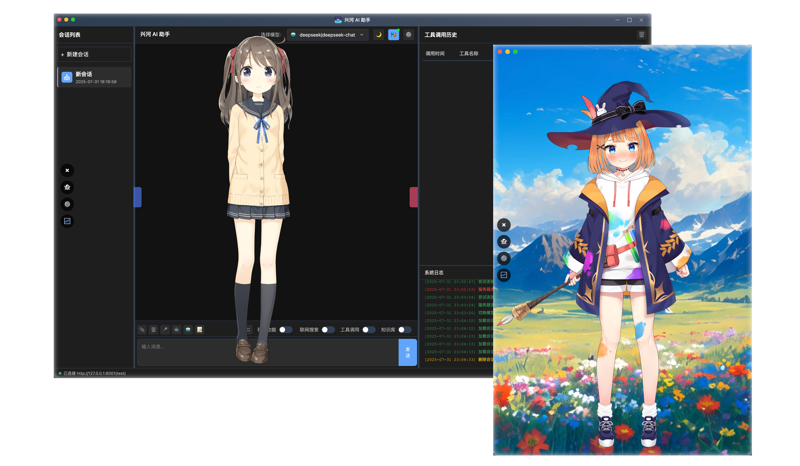

<picture>
  <source media="(prefers-color-scheme: light)" srcset="标题.png">
  
</picture>
<h1 align="center">支持多客户端 向红后进发的 的 AI 🤖</h1>


# 简介

- 兴河AI从2025年3月份我正式开始编写这个项目，截止到现在已经有了5个月的时间了，真的走了很多弯路，也从这个项目上学到了很多关于AI开发的知识，当然我最想要的还是一个可以陪伴我、帮助我、以及未来可以帮助到他人的项目，我对这个软件未来的畅想比较远，就不在这里和大家一一诉说了，想的多并没有用，而是有动力能一直做下去。
- 兴河AI一直缺少一个像样的说明文档，作为个人开发项目，我本人对写文档并不擅长，甚至感觉自己的文笔很差，写不好，但是一个好的工具产品，必然要使用起来简单，文档齐全。软件再好，如果只有你自己会用，那么它就只能算你自己YY的一个念想，当然我还是想让大家都用起来，然后告诉我你们接下来想要什么。
- 我在形象系统上下了很多的功夫，甚至超过了AI Agent本身，因为我想AI大模型会一直进步，也许现在实现不了或者实现起来有困难的地方，未来都可以被模型迭代所解决，但是我不希望它是冷冰冰的一堆文字，在空旷的对话框里闪现，它们应该有感情，声音甚至…有生命。很多人看到AI软件是一个对话框都会失去兴趣，兴河AI也经历过这个阶段，算是必经之路吧，对于AI来说，25年deepseek的出世为AI的发展加了速，我也开始启动AI项目，因为我感觉现在的AI已经可以完成一些事情了。
- 兴河AI在1.3版本就更新了支持多用户的版本，大家如果自己部署，甚至可以拉起自己的圈子，当然现在还没有用户与用户之间的交互，不过大家不要着急，这些都在我的计划中！可能很快，AI的主动对话，甚至你能和你朋友的Live2D形象进行交流了呢！
- 还有APP端正在开发，届时你将可以在外面用手机来控制家中电脑上的兴河AI。

# 官网与使用手册

`http://www.xinghe-ai.com/`


# 预览

<picture>
  <source media="(prefers-color-scheme: light)" srcset="main.png">
  
</picture>


# 安装
bilibili教程：`https://www.bilibili.com/video/BV1Qn53zBEAU`
## 客户端安装
选择自己合适的平台进行安装即可。
## 服务端安装
准备：
服务端使用了`LibreOffice`的一些功能，请先安装`LibreOffice`：https://zh-tw.libreoffice.org/download/download-libreoffice/

服务端使用了ollama中的bge-m3:latest，请先安装ollama，然后`ollama pull bge-m3:latest`
```shell
1、解压下载好的xinghe_AI_Asisstant_server_v1.2.2_mac_arm.zip
2、cd xinghe_AI_Asisstant_server_v1.2.2_mac_arm
3、conda create --name xinghe python=3.11.11 //遇到选择选y就行
4、conda activate xinghe
5、pip install -r requirements.txt //有的版本我忘记放了，github首页我传了一个，放到和main.py平级目录即可
6、cd ExternalTools/mcp-sse-client-python/
7、python setup.py install
8、cd ../../
9、playwright install
10、python create_token.py #生成token，这是访问服务器的必须要素。如果token泄漏或想更换token，请再次执行上述命令
```
因为不同操作系统管理多进程有差异，所以列举了以下启动命令：

启动方式：`python -m uvicorn main:app --workers 5`

没有授权文件请联系作者获取，获取到授权文件放在`main.py`同级目录即可。


## TTS 文本转语音(6月7日更新)
PS：今后仅支持流式TTS，其他TTS的支持被删除。后续会适配音色更好的TTS。

下载`ws_edge.zip`，在github首页TTS的文件夹里，解压后：
```
conda create --name=ws_edge python=3.11.13
conda activate ws_edge
cd ws_edge
pip install -r requirements.txt
python app/websocket_edge_tts.py
```
然后到兴河AI客户端配置即可`ws://127.0.0.1:5050/`

## ASR 安装
bilibili教程：`https://www.bilibili.com/video/BV1GhJzzPE2U`

拉取镜像
```shell
docker run -p 10096:10095 -it --privileged=true \
  -v $PWD/funasr-runtime-resources/models:/workspace/models \
  registry.cn-hangzhou.aliyuncs.com/funasr_repo/funasr:funasr-runtime-sdk-online-cpu-0.1.12
```
进入容器，启动服务
```shell
cd FunASR/runtime
bash run_server_2pass.sh \
  --download-model-dir /workspace/models \
  --vad-dir damo/speech_fsmn_vad_zh-cn-16k-common-onnx \
  --model-dir damo/speech_paraformer-large-vad-punc_asr_nat-zh-cn-16k-common-vocab8404-onnx  \
  --online-model-dir damo/speech_paraformer-large_asr_nat-zh-cn-16k-common-vocab8404-online-onnx  \
  --punc-dir damo/punc_ct-transformer_zh-cn-common-vad_realtime-vocab272727-onnx \
  --lm-dir damo/speech_ngram_lm_zh-cn-ai-wesp-fst \
  --itn-dir thuduj12/fst_itn_zh \
    --certfile 0 \
  --hotword /workspace/models/hotwords.txt
```

## 视觉FastVLM安装
bilibili教程：`https://www.bilibili.com/video/BV1hEJJz6EAW`

夸克网盘下载链接：https://pan.quark.cn/s/36950840ee1e 提取码：WHTM
```
1、zip文件下载完成后解压
2、使用命令行进入zip解压的目录
3、conda create -n fastvlm python=3.10
4、conda activate fastvlm
5、pip install -e .
6、python main.py
```
就可以看到api的端口，去兴河AI填上`http://127.0.0.1:9091/descImage`即可。


# 联系我

<picture>
  <source media="(prefers-color-scheme: light)" srcset="二维码.jpg">
  
</picture>
