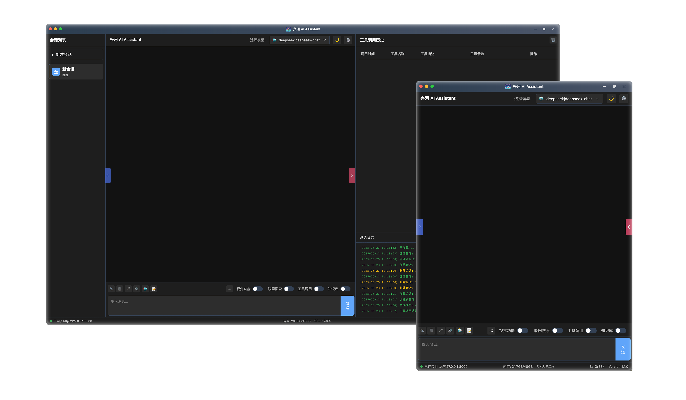
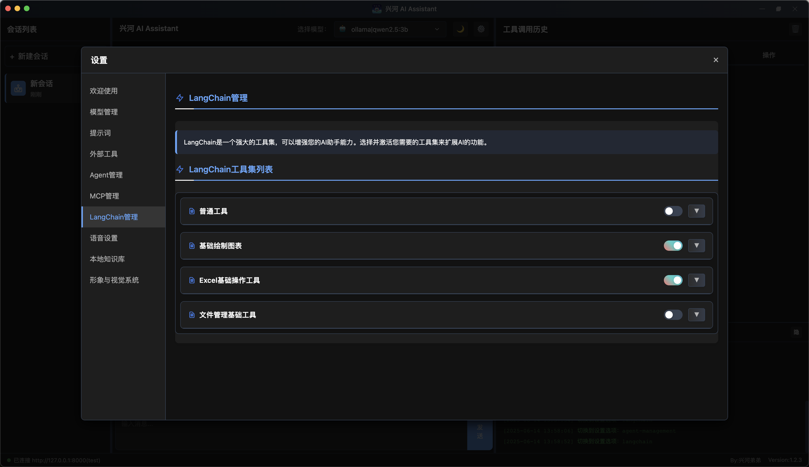
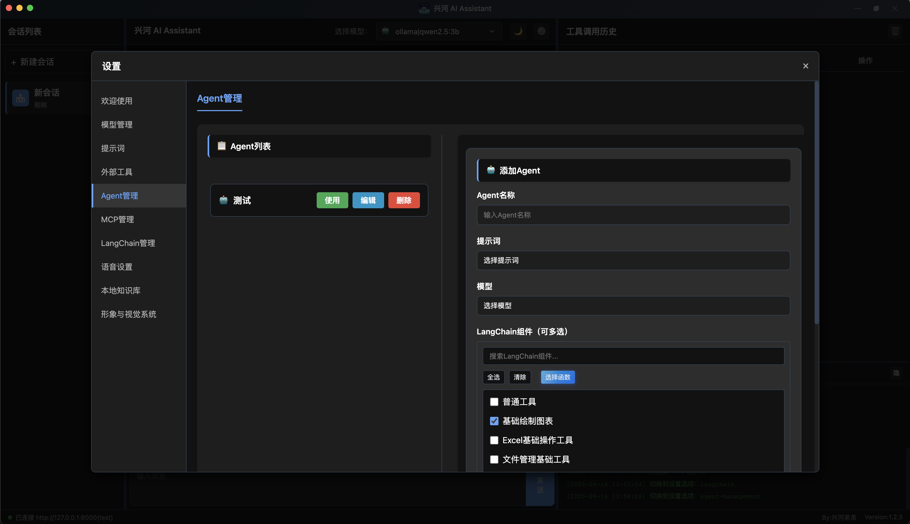

<picture>
  <source media="(prefers-color-scheme: light)" srcset="标题.png">
  
</picture>
<h1 align="center">支持多客户端 & Langchain和MCP 统一调用的 AI 🤖</h1>


# 简介

兴河 AI Assistant 是一个通用型Agent，旨在完成用户交代的各种任务，可以根据需求连接不同的大模型、MCP工具、Langchain工具、提示词，组建可编排的特定场景下的Agent，它还具有图片多模态的解析和生成功能、Computer Use、Browser Use、Phone Use可以接管你的电脑、浏览器、手机。
    
Agent的开发离不开外部工具的支持，兴河 AI Assistant 统一了工具调用的兼容性，使得外部MCP和Langchain工具可以统一接入LLM，目前正在积极的适配和接入外部工具，使得大模型可以快速拥有操纵外部的手脚。
    
我也会积极听取大家的意见，制作最贴合大家需求的Langchain或MCP工具，希望可以在内测期间和大家多多交流。

自从5.7日开启内测后，至今（6.2日），修复了很多问题，同时也新增了很多功能，客户端也从开始的单用户迈向了多用户支持。

在我的设想里 兴河 AI 以后将会是我所做的所有产品的核心，它具同时有支持多客户端多个Live2d形象的强大能力。是驱动未来人工智能交互方式的绝对核心！


# 预览

<picture>
  <source media="(prefers-color-scheme: light)" srcset="兴河AI_Assistant_Image.png">
  
</picture>


<picture>
  <source media="(prefers-color-scheme: light)" srcset="Langchain界面.png">
  
</picture>

<picture>
  <source media="(prefers-color-scheme: light)" srcset="Agent编排.png">
  
</picture>

# 安装
bilibili教程：`https://www.bilibili.com/video/BV1Qn53zBEAU`
## 客户端安装
选择自己合适的平台进行安装即可。
## 服务端安装
准备：
服务端使用了`LibreOffice`的一些功能，请先安装`LibreOffice`：https://zh-tw.libreoffice.org/download/download-libreoffice/

服务端使用了ollama中的bge-m3:latest，请先安装ollama，然后`ollama pull bge-m3:latest`
```shell
1、解压下载好的xinghe_AI_Asisstant_server_v1.2.2_mac_arm.zip
2、cd xinghe_AI_Asisstant_server_v1.2.2_mac_arm
3、conda create --name xinghe python=3.11.11 //遇到选择选y就行
4、conda activate xinghe
5、pip install -r requirements.txt //有的版本我忘记放了，github首页我传了一个，放到和main.py平级目录即可
6、cd ExternalTools/mcp-sse-client-python/
7、python setup.py install
8、cd ../../
9、playwright install
10、python create_token.py #生成token，这是访问服务器的必须要素。如果token泄漏或想更换token，请再次执行上述命令
```
因为不同操作系统管理多进程有差异，所以列举了以下启动命令：

启动方式：`python -m uvicorn main:app --workers 5`

没有授权文件请联系作者获取，获取到授权文件放在`main.py`同级目录即可。


## TTS 文本转语音(6月7日更新)
PS：今后仅支持流式TTS，其他TTS的支持被删除。后续会适配音色更好的TTS。

下载`ws_edge.zip`，在github首页TTS的文件夹里，解压后：
```
conda create --name=ws_edge python=3.11.13
conda activate ws_edge
cd ws_edge
pip install -r requirements.txt
python app/websocket_edge_tts.py
```
然后到兴河AI客户端配置即可`ws://127.0.0.1:5050/`

## ASR 安装
bilibili教程：`https://www.bilibili.com/video/BV1GhJzzPE2U`

拉取镜像
```shell
docker run -p 10096:10095 -it --privileged=true \
  -v $PWD/funasr-runtime-resources/models:/workspace/models \
  registry.cn-hangzhou.aliyuncs.com/funasr_repo/funasr:funasr-runtime-sdk-online-cpu-0.1.12
```
进入容器，启动服务
```shell
cd FunASR/runtime
bash run_server_2pass.sh \
  --download-model-dir /workspace/models \
  --vad-dir damo/speech_fsmn_vad_zh-cn-16k-common-onnx \
  --model-dir damo/speech_paraformer-large-vad-punc_asr_nat-zh-cn-16k-common-vocab8404-onnx  \
  --online-model-dir damo/speech_paraformer-large_asr_nat-zh-cn-16k-common-vocab8404-online-onnx  \
  --punc-dir damo/punc_ct-transformer_zh-cn-common-vad_realtime-vocab272727-onnx \
  --lm-dir damo/speech_ngram_lm_zh-cn-ai-wesp-fst \
  --itn-dir thuduj12/fst_itn_zh \
    --certfile 0 \
  --hotword /workspace/models/hotwords.txt
```

## 视觉FastVLM安装
bilibili教程：`https://www.bilibili.com/video/BV1hEJJz6EAW`

夸克网盘下载链接：https://pan.quark.cn/s/36950840ee1e 提取码：WHTM
```
1、zip文件下载完成后解压
2、使用命令行进入zip解压的目录
3、conda create -n fastvlm python=3.10
4、conda activate fastvlm
5、pip install -e .
6、python main.py
```
就可以看到api的端口，去兴河AI填上`http://127.0.0.1:9091/descImage`即可。


# 授权码获取

一、转发集赞

用户身份是公众号主：联系我转推公众号文章。

用户身份是普通用户：转发公众号文章到朋友圈，集赞38个。


二、关注找我进群

关注bilibili “**兴河弟弟**”，在首页置顶视频一键三连+评论区留言，然后在b站私信我带上集赞截图或者转推文章截图会将大家拉到内测群中。（在一已经完成的基础上）


三、本次内测时间**2025年5月7日-2025年7月7日**，时间之内，均可申请内测。


四、内测时间内，根据大家提出的意见和bug（可在交流群和github提出），会继续完善兴河AI的功能，可以在群里和大家一起讨论AI的发展之路，也邀请拥有开发能力的开发者，共建langchain和mcp生态，让AGI更早到来！**对社区有贡献的开发者，将持续免费**！


如果您感觉对您有帮助，希望您可以成为我b站的原始粉丝（**突破1000粉之前**），后续有活动原始粉丝优先。


内测期间，兴河AI助手**完全免费**，有向您付费出售的，请喷他拉黑举报三连。


# 联系我

<picture>
  <source media="(prefers-color-scheme: light)" srcset="二维码.jpg">
  
</picture>
