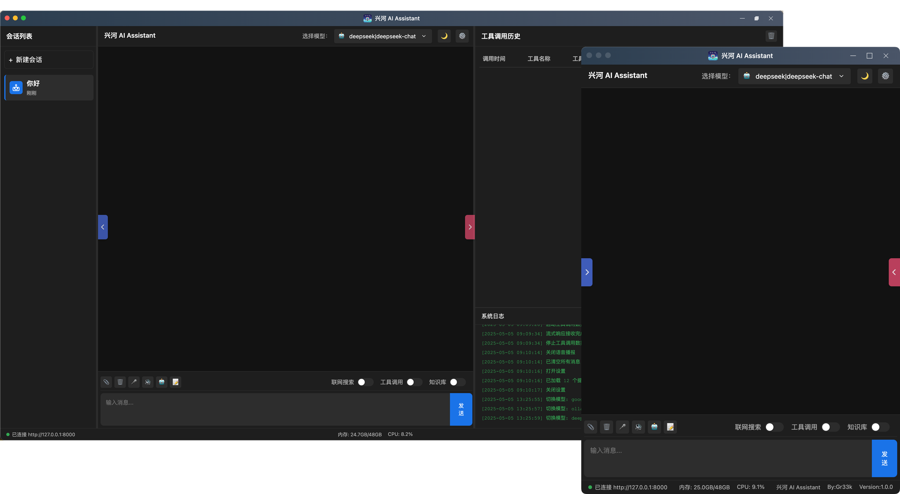

<picture>
  <source media="(prefers-color-scheme: light)" srcset="标题.png">
  
</picture>
<h1 align="center">LangChain & MCP 统一调用的 AI 🤖</h1>


# 简介

兴河 AI Assistant 是一个通用型Agent，旨在完成用户交代的各种任务，可以根据需求连接不同的大模型、MCP工具、Langchain工具、提示词，组建可编排的特定场景下的Agent，它还具有图片多模态的解析和生成功能、Computer Use、Browser Use、Phone Use可以接管你的电脑、浏览器、手机。
    
Agent的开发离不开外部工具的支持，兴河 AI Assistant 统一了工具调用的兼容性，使得外部MCP和Langchain工具可以统一接入LLM，目前正在积极的适配和接入外部工具，使得大模型可以快速拥有操纵外部的手脚。
    
我也会积极听取大家的意见，制作最贴合大家需求的Langchain或MCP工具，希望可以在内测期间和大家多多交流。


# 预览

<picture>
  <source media="(prefers-color-scheme: light)" srcset="组合.png">
  
</picture>

# 安装
## 客户端安装
选择自己合适的平台进行安装即可。
## 服务端安装
准备：
服务端使用了`LibreOffice`的一些功能，请先安装`LibreOffice`：https://zh-tw.libreoffice.org/download/download-libreoffice/

服务端使用了ollama中的bge-m3:latest，请先安装ollama，然后`ollama pull bge-m3:latest`
```shell
1、解压下载好的xinghe_assistant_server_mac_arm_v1.0.0.zip
2、cd xinghe_assistant_server_v1.0.0_mac_arm
3、conda create --name xinghe python=3.11 //遇到选择选y就行
4、conda activate xinghe
5、pip install -r requirements.txt
6、cd ExternalTools/mcp-sse-client-python/
7、python setup.py install
8、cd ../../
9、playwright install
10、python main.py --workers=5 #使用gemini等国外模型记得要先设置命令行代理
```

没有授权文件请联系作者获取，获取到授权文件放在`main.py`同级目录即可。

关于身份验证，本程序仅使用随机数生成`token`，无会话有效时间，在正常进入程序前，请使用
```
python create_token.py
```
来创建`token`文件，如果`token`泄漏或想更换`token`，请再次执行上述命令。
