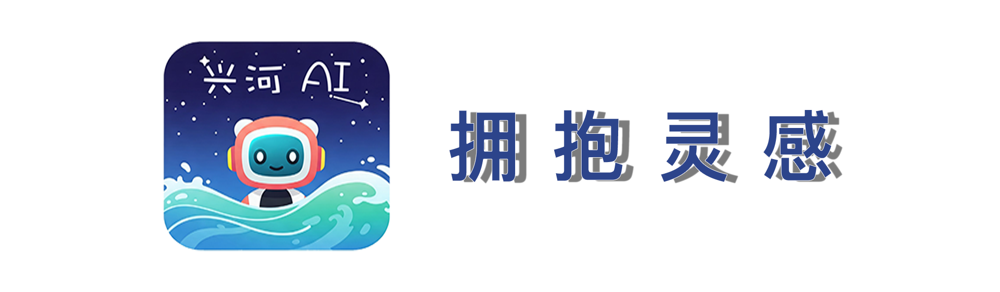

<picture>
  <source media="(prefers-color-scheme: light)" srcset="标题.png">
  
</picture>
<h1 align="center">LangChain & MCP 统一调用的 AI 🤖</h1>

# 简介

    兴河 AI Assistant 是一个通用型Agent，旨在完成用户交代的各种任务，可以根据需求连接不同的大模型、MCP工具、Langchain工具、提示词，组建可编排的特定场景下的Agent，它还具有图片多模态的解析和生成功能、Computer Use、Browser Use、Phone Use可以接管你的电脑、浏览器、手机。
    
    Agent的开发离不开外部工具的支持，兴河 AI Assistant 统一了工具调用的兼容性，使得外部MCP和Langchain工具可以统一接入LLM，目前正在积极的适配和接入外部工具，使得大模型可以快速拥有操纵外部的手脚。
    
    我也会积极听取大家的意见，制作最贴合大家需求的Langchain或MCP工具，希望可以在内测期间和大家多多交流。

# 预览

